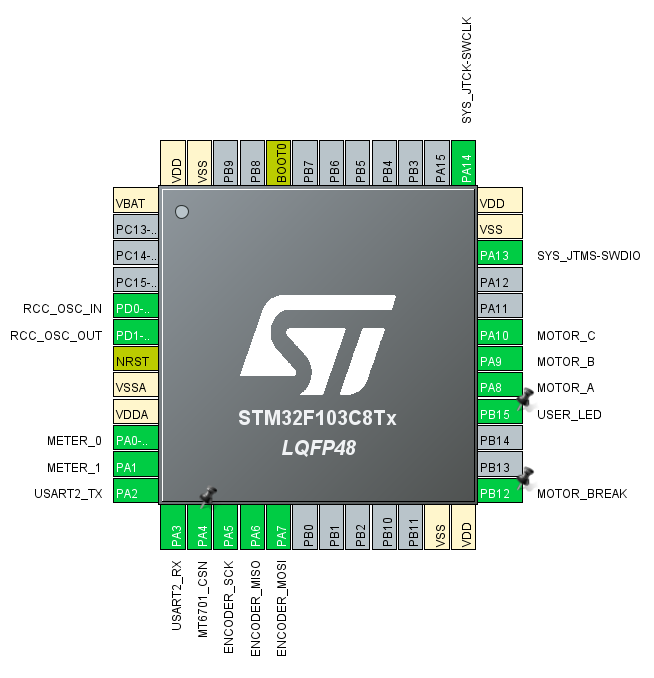

# nagi-stm32f1-foc

[English](README.md) | [中文](README_CN.md)

# Introduction
This project implements FOC control of BLDC motors based on STM32F103C8T6. The pin definitions are as follows:

The motor driver uses MS8313/DRV8313, which has three built-in half-bridge drivers and protection circuits, reducing the requirements for driver design.

Current sampling uses INA199A, with an operational amplifier gain of 50x and a sampling resistance of 0.02Ω.

The encoder uses MT6701 magnetic encoder, reading angles via SPI.

The PWM frequency is 28kHz center-aligned. Current sampling occurs every 7 PWM cycles at the center-aligned point, with ADC1 and ADC2 sampling synchronously at 4kHz.
Motor control code executes in the ADC sampling interrupt.

## Development Environment

Open `nagi_stm32f1_foc.ioc` with STM32CubeMX and export it as a CMake project. Then use VSCode for development (STM32 extension required).